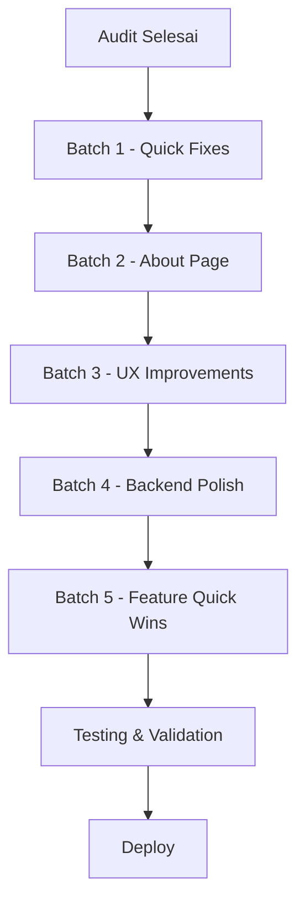

# Audit Komprehensif & Rencana Perbaikan Konektivitas.com

> Tanggal: 2026-08-03
> Status: Siap diimplementasi

---

## Ringkasan Temuan

Dari audit menyeluruh terhadap seluruh kode sumber, ditemukan **11 bug/inconsistensi**, **9 improvement UX/SEO**, dan **5 fitur baru ringan**.

---

## PRIORITAS 1 — Bug & Inconsistencies (Harus Diperbaiki)

### 1.1 Tagline/Deskripsi Konsistensi ❌
**File terdampak:** 8 file
**Dampak:** Branding konsisten

| File | Lokasi | Masalah |
|------|--------|---------|
| `app/config.py:12` | `APP_DESCRIPTION` | Masih "Infrastruktur Internet Gratis untuk Indonesia" |
| `app/templates/base.html:9` | meta description | Old tagline |
| `app/templates/base.html:15` | og:description | Old tagline |
| `app/templates/base.html:31` | JSON-LD description | Old tagline |
| `app/templates/base.html:200` | Footer copyright | "Infrastruktur Internet Gratis untuk Indonesia" |
| `app/templates/index.html:2` | Title block | "Infrastruktur Internet Gratis untuk Indonesia" |
| `app/templates/index.html:6` | Hero description | Old tagline |
| `app/templates/about.html:3` | meta description | Old description |
| `app/templates/about.html:8` | Hero text | Old tagline |
| `app/data/faq_data.py:6` | FAQ answer | Old description |
| `app/static/manifest.json:2` | PWA name | "Utilitas Internet Indonesia" |
| `app/static/manifest.json:4` | PWA description | Old description |

**Perubahan:**
- Tagline baru: "Memahami. Mengelola. Mengembangkan Internet."
- Deskripsi: "Platform infrastruktur internet Indonesia yang membantu siapa pun memahami, mengelola, dan mengembangkan aset digital mereka."

### 1.2 About Page Vision/Mission Outdated ❌
**File:** `app/templates/about.html`
**Masalah:** Visi, misi, roadmap, dan statistik masih versi lama

**Perlu diupdate:**
- Visi baru: "Menjadi platform infrastruktur internet terbesar di Indonesia"
- Misi: 5 poin baru
- Timeline roadmap: sesuai 3 produk (Public Tools, Workspace, BI)
- Statistik: tambah "3 Produk" dan ubah "100% Gratis" jadi "Public Tools Gratis"

### 1.3 History Tool Name Mismatch ❌
**File:** `app/static/js/app.js:248-256`, semua tool templates
**Masalah:** `extractToolName()` mengambil path pertama (misal `dns`), tapi `displayHistory()` menggunakan key berbeda (misal `dns-lookup`). History tidak akan tampil.

**Contoh:**
- Endpoint: `/dns/google.com` → `extractToolName()` = `dns`
- Template: `displayHistory('dns-lookup', ...)` = `dns-lookup`
- Result: History tidak pernah cocok

**Fix:** Samakan key history. Gunakan nama tool page sebagai key, dan update `extractToolName()` atau buat mapping.

### 1.4 Error Message XSS Vulnerability ❌
**File:** `app/static/js/app.js:319`
**Masalah:** `error.message` dimasukkan langsung ke HTML tanpa escaping
```javascript
// CURRENT (BUG)
`⚠️ Gagal mengambil data: ${error.message}`

// FIX
`⚠️ Gagal mengambil data: ${escapeHtml(error.message)}`
```

### 1.5 Search Filter Selector Bug ❌
**File:** `app/static/js/app.js:69`
**Masalah:** Selector `.tool-card[style=""]` tidak work untuk cards yang di-hide via JS
```javascript
// CURRENT (BUG)
var visibleCards = section.querySelectorAll('.tool-card[style=""], .tool-card:not([style])');

// FIX - check display property langsung
section.querySelectorAll('.tool-card').forEach(function(c) {
    if (c.style.display !== 'none') hasVisible = true;
});
```
**Catatan:** Baris 71-73 sudah benar, baris 69 sebenarnya tidak dipakai (dead code). Hapus baris 69.

### 1.6 OG URL Mismatch ❌
**File:** `app/templates/base.html:17`
**Masalah:** `{{ request.url }}` output full URL termasuk scheme, tapi canonical URL di line 19 pakai hardcoded domain
```html
<!-- CURRENT (BUG) -->
<meta property="og:url" content="{{ request.url }}">

<!-- FIX -->
<meta property="og:url" content="https://konektivitas.com{{ request.url.path }}">
```

---

## PRIORITAS 2 — UX Improvements (Ringan)

### 2.1 Category Filter via URL ⚡
**File:** `app/templates/index.html` (scripts block)
**Masalah:** Breadcrumb links ke `/?category=dns` tapi tidak ada JS yang auto-scroll/filter

**Tambahkan JS:**
```javascript
// Auto-filter by category from URL
(function() {
    var params = new URLSearchParams(window.location.search);
    var category = params.get('category');
    if (category) {
        filterTools(category);
        // Scroll ke section yang match
        var section = document.querySelector('[data-category="' + category + '"]');
        if (section) section.scrollIntoView({ behavior: 'smooth', block: 'start' });
    }
})();
```

### 2.2 Web Share API for Mobile ⚡
**File:** `app/static/js/app.js`
**Tambahkan:** Share button yang pakai Web Share API di mobile

```javascript
function shareResults() {
    if (navigator.share) {
        navigator.share({
            title: 'Konektivitas.com - Hasil Pengecekan',
            url: window.location.href
        });
    } else {
        copyToClipboard(window.location.href);
    }
}
```

### 2.3 Footer Copyright Auto-Year ⚡
**File:** `app/templates/base.html:200`
**Fix:** `&copy; 2026` → `&copy; <script>document.write(new Date().getFullYear())</script>`
Atau lebih baik: `{{ current_year }}` via context processor.

### 2.4 Tool Card Clickable Area Improvement ⚡
**File:** `app/static/css/style.css`
**Masalah:** Tool cards sudah pakai `<a>` tag, tapi pastikan cursor dan hover state konsisten

### 2.5 Port Scanner Mobile Result Improvement ⚡
**File:** `app/static/css/style.css`
**Masalah:** Pada 480px, `th` di-hide tapi port name hilang
**Fix:** Pastikan port name muncul via `data-label` attribute di `td`

---

## PRIORITAS 3 — SEO Improvements (Ringan)

### 3.1 Structured Data Enhancement ⚡
**File:** `app/templates/base.html`
**Tambahkan:** SoftwareApplication schema sudah ada. Bisa tambah Organization schema:
```json
{
    "@type": "Organization",
    "name": "Konektivitas.com",
    "url": "https://konektivitas.com",
    "logo": "https://konektivitas.com/static/logo.png",
    "description": "Platform infrastruktur internet Indonesia"
}
```

### 3.2 Meta Robots for Tool Pages ⚡
**File:** Tool pages
**Sudah benar:** robots.txt mengizinkan semua halaman. ✅

### 3.3 Sitemap Update Frequency ⚡
**File:** `app/main.py:350-380`
**Sudah benar:** Dynamic sitemap dengan lastmod hari ini. ✅

### 3.4 Missing `about` Breadcrumb ⚡
**File:** `app/templates/about.html`
**Tambahkan:** Breadcrumb untuk About page
```html
<nav class="breadcrumb">
    <a href="/" class="breadcrumb-item">🏠 Beranda</a>
    <span class="breadcrumb-sep">›</span>
    <span class="breadcrumb-item breadcrumb-current">Tentang</span>
</nav>
```

### 3.5 Missing `api-docs` Breadcrumb ⚡
**File:** `app/templates/api_docs.html`
**Tambahkan:** Breadcrumb untuk API Docs page

---

## PRIORITAS 4 — Backend Improvements (Ringan)

### 4.1 Rate Limit Headers Enhancement ⚡
**File:** `app/main.py:118-122`
**Tambahkan:** `X-RateLimit-Reset` header
```python
response.headers["X-RateLimit-Reset"] = str(int(time.time()) + 60)
```

### 4.2 Cache Headers for Static Files ⚡
**File:** `app/main.py`
**Tambahkan:** Cache-Control headers untuk static files via middleware

### 4.3 Health Check Enhancement ⚡
**File:** `app/main.py:322-331`
**Tambahkan:** Database connectivity check, Redis connectivity check

### 4.4 User-Agent in Rate Limit Logging ⚡
**File:** `app/main.py:88`
**Sudah benar:** Logging IP, method, path, status, time. ✅

### 4.5 Missing NS Lookup TOOL_META ⚡
**File:** `app/utils/validators.py`
**Cek:** Apakah `ns_lookup` sudah ada di `TOOL_META`
**Jika belum:** Tambahkan

---

## PRIORITAS 5 — Feature Additions (Ringan, Quick Win)

### 5.1 Recently Used Section on Homepage ⚡
**File:** `app/templates/index.html:14-17`
**Sudah ada HTML:** Section `recentlyUsedSection` sudah ada tapi perlu JS untuk populate

**Tambahkan JS:**
```javascript
(function() {
    var section = document.getElementById('recentlyUsedSection');
    var grid = document.getElementById('recentlyUsedGrid');
    if (!section || !grid) return;
    
    var recentTools = [];
    for (var i = 0; i < localStorage.length; i++) {
        var key = localStorage.key(i);
        if (key.startsWith('konek_history_')) {
            var toolName = key.replace('konek_history_', '');
            var history = JSON.parse(localStorage.getItem(key) || '[]');
            if (history.length > 0) {
                recentTools.push({ name: toolName, query: history[0], count: history.length });
            }
        }
    }
    
    if (recentTools.length === 0) {
        section.classList.add('hidden-initial');
        return;
    }
    
    recentTools.sort(function(a, b) { return b.count - a.count; });
    recentTools = recentTools.slice(0, 6);
    
    var toolMap = { /* mapping tool name ke URL dan info */ };
    // Render cards
    section.classList.remove('hidden-initial');
})();
```

### 5.2 Tool Comparison Feature (Simple) ⚡
**Konsep:** Bandingkan hasil 2 domain side-by-side
**Cara:** Tambah parameter `compare` di URL, tampilkan 2 result tables berdampingan

### 5.3 Copy All Results Button ⚡
**File:** `app/static/js/app.js`
**Tambahkan:** Tombol "Salin Semua" yang copy seluruh result table sebagai text

### 5.4 Export as Text ⚡
**File:** `app/static/js/app.js`
**Tambahkan:** Tombol "Export" yang download hasil sebagai .txt file

### 5.5 Keyboard Navigation for Results ⚡
**File:** `app/static/js/app.js`
**Tambahkan:** Arrow keys untuk navigate antar rows di result table

---

## Estimasi File yang Perlu Diubah

| File | Perubahan |
|------|-----------|
| `app/config.py` | Update APP_DESCRIPTION |
| `app/templates/base.html` | Update meta tags, OG URL, footer, tambah Organization schema |
| `app/templates/index.html` | Update title, hero, tambah category filter JS, recently used JS |
| `app/templates/about.html` | Update visi, misi, roadmap, statistik, tambah breadcrumb |
| `app/templates/api_docs.html` | Tambah breadcrumb |
| `app/static/js/app.js` | Fix history key, fix error XSS, fix search filter, tambah share API, tambah export |
| `app/static/css/style.css` | Minor responsive fixes |
| `app/data/faq_data.py` | Update FAQ descriptions |
| `app/static/manifest.json` | Update name dan description |
| `app/main.py` | Tambah rate limit headers, cache headers |
| `app/utils/validators.py` | Cek/add ns_lookup TOOL_META |

---

## Urutan Pengerjaan

### Batch 1 — Quick Fixes (13 file edits)
1. Fix tagline konsistensi (8+ locations)
2. Fix error message XSS
3. Fix OG URL
4. Fix history tool name mismatch
5. Fix search filter dead code

### Batch 2 — About Page Update
6. Update about.html (visi, misi, roadmap, statistik)
7. Add breadcrumbs to about & api-docs

### Batch 3 — UX Improvements
8. Category filter via URL
9. Recently used section JS
10. Web Share API
11. Footer auto-year

### Batch 4 — Backend Polish
12. Rate limit headers enhancement
13. Static file cache headers
14. Health check enhancement

### Batch 5 — Feature Quick Wins
15. Copy all results
16. Export as text
17. Tool comparison (simple)

---

## Diagram Alur Perbaikan



---

> Semua perbaikan di atas bersifat **ringan** dan tidak mengubah arsitektur inti. Prioritas 1-3 bisa diselesaikan dalam satu sesi. Prioritas 4-5 bisa dilakukan bertahap.
