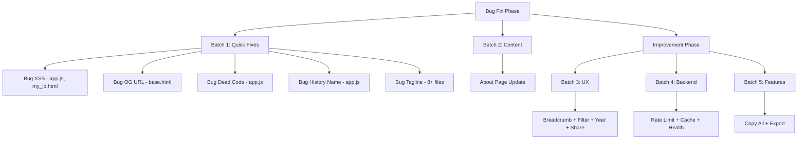

# Rencana Bug Fix & Improvement - Konektivitas.com

> Dibuat: 2026-08-03
> Berdasarkan: Hasil audit komprehensif seluruh kode

---

## Ringkasan

| Kategori | Jumlah | Status |
|----------|--------|--------|
| Bug Fix (Prioritas 1) | 6 item | 🔄 Akan dikerjakan |
| Improvement (Prioritas 2) | 9 item | ⏳ Menunggu |

---

## Prioritas 1: Bug Fixes

### Bug #1: Konsistensi Tagline

**Masalah:** 8+ file masih menggunakan deskripsi lama "Infrastruktur Internet Gratis untuk Indonesia" padahal visi baru sudah ditetapkan.

**Tagline Baru:**
- Tagline: "Memahami. Mengelola. Mengembangkan Internet."
- Deskripsi: "Platform infrastruktur internet Indonesia yang membantu siapa pun memahami, mengelola, dan mengembangkan aset digital mereka."

**File yang perlu diupdate:**

| # | File | Lokasi | Saat Ini | Perubahan |
|---|------|--------|----------|-----------|
| 1 | `app/config.py` | Line 12 | `APP_DESCRIPTION = "Infrastruktur Internet Gratis untuk Indonesia"` | Update ke deskripsi baru |
| 2 | `app/templates/base.html` | Line 9 | Meta description fallback | Update ke deskripsi baru |
| 3 | `app/templates/base.html` | Line 15 | OG description fallback | Update ke deskripsi baru |
| 4 | `app/templates/base.html` | Line 31 | JSON-LD WebApplication description | Update ke deskripsi baru |
| 5 | `app/templates/base.html` | Line 200 | Footer copyright text | Update ke tagline baru |
| 6 | `app/templates/index.html` | Line 2 | Page title: `Konektivitas.com - Infrastruktur Internet Gratis untuk Indonesia` | Update ke tagline baru |
| 7 | `app/templates/index.html` | Line 6-7 | Hero subtitle | Update ke deskripsi baru |
| 8 | `app/templates/about.html` | Line 3-4 | Meta description | Update ke deskripsi baru |
| 9 | `app/templates/about.html` | Line 8 | Hero subtitle | Update ke tagline baru |
| 10 | `app/data/faq_data.py` | Line 6 | FAQ answer tentang Konektivitas.com | Update ke deskripsi baru |
| 11 | `app/data/faq_data.py` | Line 10 | FAQ answer tentang gratis | Update sesuai model baru (Public Tools gratis) |
| 12 | `app/static/manifest.json` | Line 2 | PWA app name | Update ke tagline baru |
| 13 | `app/static/manifest.json` | Line 4 | PWA description | Update ke deskripsi baru |

---

### Bug #2: XSS Vulnerability - Error Message

**Masalah:** `error.message` dimasukkan ke HTML tanpa escape, bisa menjadi vector XSS jika error message mengandung HTML/script.

**Lokasi:**
1. `app/static/js/app.js` Line 319: `${error.message}` di template literal
2. `app/templates/tools/my_ip.html` Line 85: `${error.message}` di template literal

**Perbaikan:**
```javascript
// SEBELUM (app.js:319)
<p>⚠️ Gagal mengambil data: ${error.message}</p>

// SESUDAH
<p>⚠️ Gagal mengambil data: ${escapeHtml(error.message)}</p>
```

```javascript
// SEBELUM (my_ip.html:85)
<p>⚠️ Gagal mendeteksi IP: ${error.message}</p>

// SESUDAH
<p>⚠️ Gagal mendeteksi IP: ${escapeHtml(error.message)}</p>
```

> Catatan: `escapeHtml()` sudah tersedia di app.js line 420-424.

---

### Bug #3: OG URL Bug

**Masalah:** `base.html:17` menggunakan `{{ request.url }}` yang menghasilkan URL lengkap termasuk scheme dan port (misal `http://localhost:8002/dns-lookup`). Canonical URL di line 19 sudah benar menggunakan hardcoded domain.

**Perbaikan:**
```html
<!-- SEBELUM (base.html:17) -->
<meta property="og:url" content="{{ request.url }}">

<!-- SESUDAH -->
<meta property="og:url" content="https://konektivitas.com{{ request.url.path }}">
```

---

### Bug #4: History Tool Name Mismatch

**Masalah:** `extractToolName()` di app.js:254 mengekstrak nama tool dari API endpoint:
- `/dns/google.com` → mengembalikan `dns`
- `/ssl/example.com` → mengembalikan `ssl`
- `/whois/example.com` → mengembalikan `whois`

Tapi semua templates menggunakan page-based keys:
- `displayHistory('dns-lookup', 'historyContainer')`
- `displayHistory('ssl-checker', 'historyContainer')`
- `displayHistory('whois-lookup', 'historyContainer')`

Akibatnya history **tidak pernah muncul** karena key tidak cocok.

**Perbaikan:** Buat mapping dari API path ke page-based tool name:

```javascript
// SEBELUM
function extractToolName(endpoint) {
    var parts = endpoint.split('?')[0].split('/').filter(function (p) { return p && p !== 'api' && p !== 'v1'; });
    return parts[0] || 'unknown';
}

// SESUDAH
function extractToolName(endpoint) {
    // Map API endpoint path to page-based tool name used by displayHistory/saveToHistory
    var TOOL_NAME_MAP = {
        'dns': 'dns-lookup',
        'whois': 'whois-lookup',
        'ssl': 'ssl-checker',
        'ping': 'ping-checker',
        'ip': 'ip-lookup',
        'ua': 'ua-checker',
        'email': 'email-validator',
        'port': 'port-scanner',
        'cdn': 'cdn-detect'
    };
    var parts = endpoint.split('?')[0].split('/').filter(function (p) { return p && p !== 'api' && p !== 'v1'; });
    var rawName = parts[0] || 'unknown';
    return TOOL_NAME_MAP[rawName] || rawName;
}
```

> **Catatan tambahan:** Untuk endpoint spesifik seperti `/dns/{domain}/mx`, `/dns/{domain}/txt`, `/domain/{domain}/expiry`, `/ssl/{domain}/expiry` — perlu mapping lebih detail. Tapi untuk MVP, mapping dasar sudah cukup karena tool pages utama sudah benar.

---

### Bug #5: Dead Code Search Filter

**Masalah:** `app.js:69` memiliki selector yang tidak berguna:
```javascript
var visibleCards = section.querySelectorAll('.tool-card[style=""], .tool-card:not([style])');
```
Variabel `visibleCards` dideklarasikan tapi **tidak pernah digunakan**. Kode yang benar ada di lines 71-73.

**Perbaikan:** Hapus line 69 yang tidak terpakai:
```javascript
// HAPUS baris ini:
var visibleCards = section.querySelectorAll('.tool-card[style=""], .tool-card:not([style])');
```

---

### Bug #6: About Page Outdated Content

**Masalah:** `about.html` masih menampilkan visi, misi, roadmap, dan statistik versi lama.

**Perubahan yang diperlukan:**

1. **Visi** - Update ke: "Menjadi platform infrastruktur internet terbesar di Indonesia yang membantu siapa pun memahami, mengelola, dan mengembangkan aset digital mereka."

2. **Misi** - Update ke 5 poin:
   - Membuat infrastruktur internet mudah dipahami
   - Membantu pengguna mengelola aset digital dari satu dashboard
   - Memberikan peringatan sebelum masalah terjadi
   - Menyediakan insight untuk menemukan peluang digital baru
   - Menjadi referensi edukasi internet berbahasa Indonesia

3. **Filosofi** - Tambahkan 3 produk: Public Tools, Workspace, Business Intelligence

4. **Roadmap** - Update deskripsi setiap fase sesuai visi baru

5. **Statistik** - Update:
   - 25+ Tools Aktif → Public Tools Gratis
   - 5 Kategori
   - 3 Produk (Public Tools, Workspace, BI)
   - < 1s Response Time

---

## Prioritas 2: Improvements

### Improvement #1: Breadcrumb Navigation

**File:** `app/templates/about.html`, `app/templates/api_docs.html`

Tambahkan breadcrumb navigation ke kedua halaman ini, mengikuti pola yang sudah ada di tool templates.

### Improvement #2: Category Filter via URL

**File:** `app/templates/index.html` (script section)

Aktifkan filter kategori berdasarkan URL parameter `?category=dns` (sudah ada placeholder di breadcrumb links).

### Improvement #3: Footer Copyright Year Otomatis

**File:** `app/templates/base.html` Line 200

Ganti `2026` dengan dynamic year menggunakan Jinja2: `{{ now().year }}` atau JavaScript.

### Improvement #4: Rate Limit Response Headers

**File:** `app/main.py` (SecurityHeadersMiddleware)

Tambahkan headers informatif:
- `X-RateLimit-Limit: 60`
- `X-RateLimit-Remaining: {remaining}`
- `X-RateLimit-Reset: {timestamp}`

### Improvement #5: Static File Cache Headers

**File:** `app/main.py`

Tambahkan cache headers untuk static files (CSS, JS, images) dengan expiry yang sesuai.

### Improvement #6: Health Check Enhancement

**File:** `app/main.py` Line 321-331

Tambahkan info: uptime, cache stats, rate limit stats.

### Improvement #7: Web Share API

**File:** `app/static/js/app.js`

Tambahkan tombol share yang menggunakan Web Share API (dengan fallback ke clipboard).

### Improvement #8: Copy All Results

**File:** `app/static/js/app.js`, tool templates

Tambahkan tombol "Salin Semua" untuk menyalin seluruh hasil dalam format teks.

### Improvement #9: Export Results

**File:** `app/static/js/app.js`

Tambahkan opsi export hasil ke format teks (plain text) untuk kemudahan sharing.

---

## Urutan Eksekusi

```
Batch 1: Quick Bug Fixes
├── Bug #2: XSS fix (app.js + my_ip.html) — paling kritis
├── Bug #3: OG URL fix (base.html)
├── Bug #5: Dead code cleanup (app.js)
├── Bug #4: History name mismatch (app.js)
└── Bug #1: Tagline consistency (8+ files)

Batch 2: Content Update
└── Bug #6: About page update (about.html)

Batch 3: UX Improvements
├── Improvement #1: Breadcrumb (about.html, api_docs.html)
├── Improvement #2: Category filter URL (index.html)
├── Improvement #3: Dynamic year (base.html)
└── Improvement #7: Web Share API (app.js)

Batch 4: Backend Polish
├── Improvement #4: Rate limit headers (main.py)
├── Improvement #5: Static cache headers (main.py)
└── Improvement #6: Health check enhancement (main.py)

Batch 5: Feature Quick Wins
├── Improvement #8: Copy all results (app.js)
└── Improvement #9: Export as text (app.js)
```

---

## Diagram Alur Perbaikan



---

## Risk Assessment

| Item | Risiko | Mitigasi |
|------|--------|----------|
| Tagline change | Low | Pure text replacement |
| XSS fix | Low | Menggunakan escapeHtml() yang sudah ada |
| OG URL fix | Low | Hardcoded domain seperti canonical URL |
| History name mismatch | Medium | Perlu testing semua 25 tool pages |
| About page update | Low | Content update saja |
| Dead code removal | Low | Variabel tidak dipakai |

---

> **Estimasi file yang akan dimodifikasi:**
> - Bug Fixes: ~12 file
> - Improvements: ~5 file
> - Total: ~15 file (dengan beberapa overlap)
