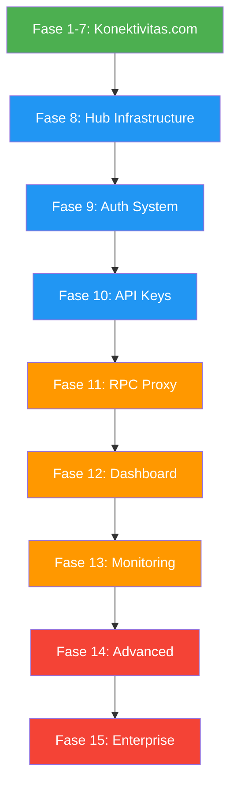

# Rencana Audit & Perbaikan Komprehensif - Konektivitas.com + Hub.konektivitas.com

> Tanggal: 2026-08-06
> Status: Menunggu Persetujuan

## Ringkasan

Rencana ini mencakup dua bagian utama:
1. **Perbaikan Konektivitas.com** - Bug fix, SEO, UI/UX, dan code quality
2. **Pengembangan Hub.konektivitas.com** - Modul baru blockchain infrastructure

---

# BAGIAN 1: Perbaikan Konektivitas.com

## FASE 1: Bug Fix & Security (Ringan)

### 1.1 Fix Karakter Cina di Education Content
- **File:** [`app/data/education.py`](app/data/education.py:386)
- **Masalah:** Karakter Cina `启用` muncul di konten edukasi DMARC
- **Fix:** Ganti `启用` → `mengaktifkan`
- **Impact:** Bug visual

### 1.2 Fix XSS Vulnerability di Error Display
- **File:** [`app/static/js/app.js`](app/static/js/app.js:432)
- **Masalah:** `data.error` dimasukkan ke `innerHTML` tanpa escaping
- **Fix:** Gunakan `escapeHtml(data.error)`
- **Impact:** Security vulnerability

### 1.3 Fix Import httpx Redundan
- **File:** [`app/services/cdn_service.py`](app/services/cdn_service.py:335)
- **Masalah:** `import httpx` di dalam function body
- **Fix:** Pindahkan ke top-level import
- **Impact:** Code quality

### 1.4 Tambahkan CSS .api-method.post
- **File:** [`app/static/css/style.css`](app/static/css/style.css:2011)
- **Masalah:** Tidak ada style untuk POST endpoints
- **Fix:** Tambahkan `.api-method.post`
- **Impact:** Visual consistency

---

## FASE 2: SEO & Accessibility (Ringan)

### 2.1 Tambahkan batch-lookup dan compare ke sitemap.xml
- **File:** [`app/main.py`](app/main.py:385)
- **Masalah:** Halaman tidak ada di sitemap
- **Fix:** Tambahkan ke daftar pages
- **Impact:** SEO

### 2.2 Tambahkan role=search pada Search Box
- **File:** [`app/templates/index.html`](app/templates/index.html:4)
- **Masalah:** Missing accessibility attribute
- **Fix:** Tambahkan `role="search"`
- **Impact:** Accessibility

---

## FASE 3: UI/UX Improvement (Ringan)

### 3.1 Smooth Scroll Behavior
- **File:** [`app/static/css/style.css`](app/static/css/style.css)
- **Fix:** Tambahkan `scroll-behavior: smooth`

### 3.2 Focus-Visible Style
- **File:** [`app/static/css/style.css`](app/static/css/style.css)
- **Fix:** Tambahkan `:focus-visible` styles

### 3.3 Mobile Nav Transition
- **File:** [`app/static/css/style.css`](app/static/css/style.css:1502)
- **Fix:** Tambahkan transition untuk mobile nav

---

## FASE 4: Feature Gap (Ringan)

### 4.1 Tambahkan FAQ Entries
- **File:** [`app/data/faq_data.py`](app/data/faq_data.py)
- **Masalah:** Hanya 8 FAQ untuk 25+ tools
- **Fix:** Tambahkan FAQ untuk semua tools

### 4.2 POST Method Badge di API Docs
- **File:** [`app/templates/api_docs.html`](app/templates/api_docs.html)
- **Fix:** Tambahkan badge POST untuk batch/compare

---

## FASE 5: Code Quality (Sedang)

### 5.1 Review Error Handling Konsistensi
### 5.2 Review Cache TTL Values
### 5.3 Tambahkan Type Hints Konsisten

---

## FASE 6: Mobile Responsive (Sedang)

### 6.1 Review Tablet Breakpoint
### 6.2 Touch-Friendly Tap Targets

---

## FASE 7: Documentation Update (Sedang)

### 7.1 Update FEATURES.md
### 7.2 Update AGENT.md
### 7.3 Update ROADMAP.md

---

# BAGIAN 2: Pengembangan Hub.konektivitas.com

> Detail lengkap di [`plans/hub-konektivitas-plan.md`](plans/hub-konektivitas-plan.md)

## FASE 8: Setup Infrastructure (Sedang)

### 8.1 Setup PostgreSQL Database
- [ ] Install PostgreSQL 15+
- [ ] Create database `hub_konektivitas`
- [ ] Setup connection pooling

### 8.2 Setup Redis
- [ ] Install Redis 7+
- [ ] Configure for caching and rate limiting

### 8.3 Setup Docker Environment
- [ ] Create Dockerfile
- [ ] Create docker-compose.yml
- [ ] Setup container networking

### 8.4 Setup Alembic Migrations
- [ ] Initialize Alembic
- [ ] Create initial migration

---

## FASE 9: Authentication System (Sedang)

### 9.1 User Registration
- [ ] Registration endpoint dengan email verification
- [ ] Password hashing dengan bcrypt
- [ ] Email verification flow

### 9.2 Login System
- [ ] JWT token generation
- [ ] Token refresh mechanism
- [ ] Session management

### 9.3 Middleware Auth
- [ ] JWT validation middleware
- [ ] API Key validation middleware
- [ ] Rate limiting per API key

---

## FASE 10: API Key Management (Sedang)

### 10.1 API Key CRUD
- [ ] Generate API keys dengan prefix `hk_`
- [ ] Hash API keys untuk storage
- [ ] List, create, update, delete keys

### 10.2 Rate Limiting
- [ ] Per-API-key rate limiting
- [ ] Configurable limits per plan
- [ ] Usage tracking

---

## FASE 11: RPC Proxy (Sedang)

### 11.1 JSON-RPC Proxy
- [ ] Proxy endpoint untuk Ethereum
- [ ] Request validation
- [ ] Response caching

### 11.2 Multi Chain Support
- [ ] Polygon (MATIC)
- [ ] Binance Smart Chain (BSC)
- [ ] Arbitrum
- [ ] Optimism

### 11.3 WebSocket Proxy
- [ ] WebSocket connection handling
- [ ] Subscription management
- [ ] Connection pooling

---

## FASE 12: Dashboard (Sedang)

### 12.1 Landing Page
- [ ] Hero section
- [ ] Features overview
- [ ] Pricing plans

### 12.2 User Dashboard
- [ ] Usage statistics
- [ ] API key management UI
- [ ] Network status overview

### 12.3 API Documentation
- [ ] Interactive API docs (Swagger)
- [ ] Code examples
- [ ] SDK information

---

## FASE 13: Monitoring (Sedang)

### 13.1 Health Checks
- [ ] System health endpoint
- [ ] Node health monitoring
- [ ] Database health

### 13.2 Prometheus Metrics
- [ ] Request metrics
- [ ] Response time metrics
- [ ] Error rate metrics

### 13.3 Grafana Dashboards
- [ ] System overview dashboard
- [ ] API performance dashboard
- [ ] Node health dashboard

---

## FASE 14: Advanced Features (Besar)

### 14.1 Load Balancer
- [ ] Round-robin routing
- [ ] Health-based routing
- [ ] Failover handling

### 14.2 Analytics
- [ ] Detailed usage analytics
- [ ] Cost tracking
- [ ] Performance metrics

### 14.3 Billing
- [ ] Usage-based billing
- [ ] Plan management
- [ ] Invoice generation

---

## FASE 15: Enterprise (Besar)

### 15.1 Global Infrastructure
- [ ] Multi-region deployment
- [ ] Auto-scaling
- [ ] CDN integration

### 15.2 Enterprise Features
- [ ] SSO integration
- [ ] Audit logging
- [ ] SLA monitoring

### 15.3 Marketplace
- [ ] Third-party node providers
- [ ] Revenue sharing
- [ ] Quality monitoring

---

## Diagram Alur Pekerjaan

## Prioritas

| Fase | Proyek | Prioritas | Kompleksitas |
|------|--------|-----------|--------------|
| 1-7 | Konektivitas.com | Tinggi | Ringan-Sedang |
| 8 | Hub Infrastructure | Tinggi | Sedang |
| 9 | Auth System | Tinggi | Sedang |
| 10 | API Keys | Tinggi | Sedang |
| 11 | RPC Proxy | Tinggi | Sedang |
| 12 | Dashboard | Sedang | Sedang |
| 13 | Monitoring | Sedang | Sedang |
| 14 | Advanced | Rendah | Besar |
| 15 | Enterprise | Rendah | Besar |

## Catatan Penting

1. **Konektivitas.com sudah production** - Tidak boleh update database yang ada
2. **Hub.konektivitas.com adalah proyek baru** - Boleh membuat database baru
3. **Shared Authentication** - Pertimbangkan SSO antara kedua platform
4. **Docker** - Gunakan Docker untuk Hub agar mudah deploy dan scale
5. **PostgreSQL** - Database relasional untuk Hub (berbeda dengan SQLite Konektivitas)
