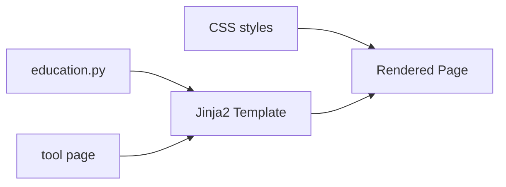

# Plan: Sentuhan Edukasi untuk 19 Tool Pages

> Menambahkan bagian edukasi interaktif di setiap halaman tool Konektivitas.com

## 🎯 Tujuan

Setiap tool page akan memiliki bagian **"Pelajari Lebih Lanjut"** yang menjelaskan:
1. Konsep dasar (Apa itu?)
2. Mengapa penting (Use case)
3. Cara membaca hasil (Interpretasi)
4. Tips & best practices
5. Tool terkait (Navigasi silang)

## 📐 Arsitektur

### Alur Data



### Struktur File Baru

```
app/
├── data/
│   └── education.py          # Konten edukasi semua tools
├── templates/
│   └── partials/
│       └── education.html    # Template partial edukasi
└── static/
    └── css/
        └── style.css         # Tambah CSS edukasi
```

## 📝 Konten Edukasi per Tool

### DNS Tools (8 tools)

#### 1. DNS Lookup (`/dns-lookup`)
- **Apa itu DNS**: Sistem penerjemah nama domain ke IP address
- **Jenis Record**: A, AAAA, MX, TXT, CNAME, NS
- **Cara Membaca**: TTL, priority, preference
- **Tips**: Gunakan Google DNS 8.8.8.8 untuk cek cepat
- **Terkait**: MX Lookup, TXT Lookup, CNAME Lookup

#### 2. Reverse DNS (`/reverse-dns`)
- **Apa itu Reverse DNS**: Lookup IP ke hostname (PTR record)
- **Mengapa Penting**: Email server verification, troubleshooting
- **Cara Membaca**: PTR record, forward-confirmed reverse DNS
- **Tips**: Penting untuk email deliverability
- **Terkait**: DNS Lookup, IP Lookup

#### 3. DNS Propagation (`/dns-propagation`)
- **Apa itu Propagasi**: Perubahan DNS yang menyebar ke semua server global
- **Mengapa Penting**: Memastikan update DNS sudah diterima semua lokasi
- **Cara Membaca**: Perbedaan antar nameserver
- **Tips**: Tunggu 24-48 jam untuk propagasi penuh
- **Terkait**: DNS Lookup, TTL

#### 4. MX Lookup (`/mx-lookup`)
- **Apa itu MX**: Mail Exchange record - server yang menangani email
- **Mengapa Penting**: Konfigurasi email, troubleshooting email
- **Cara Membaca**: Priority (angka kecil = prioritas tinggi)
- **Tips**: Gunakan minimal 2 MX record untuk redundancy
- **Terkait**: SPF Checker, TXT Lookup

#### 5. TXT Lookup (`/txt-lookup`)
- **Apa itu TXT Record**: Record teks untuk verifikasi dan keamanan
- **Jenis TXT**: SPF, DKIM, DMARC, domain verification
- **Cara Membaca**: Format SPF, DKIM selector
- **Tips**: Penting untuk email authentication
- **Terkait**: SPF Checker, DMARC Checker

#### 6. CNAME Lookup (`/cname-lookup`)
- **Apa itu CNAME**: Canonical Name - alias untuk domain lain
- **Mengapa Penting**: CDN, subdomain, redirect
- **Cara Membaca**: Target domain, TTL
- **Tips**: CNAME tidak boleh digunakan di root domain
- **Terkait**: DNS Lookup, Redirect Checker

#### 7. SPF Checker (`/spf-checker`)
- **Apa itu SPF**: Sender Policy Framework - siapa yang boleh kirim email
- **Mengapa Penting**: Mencegah email spoofing
- **Cara Membaca**: `v=spf1`, ip4, include, ~all, -all
- **Tips**: Gunakan `-all` untuk hard fail, `~all` untuk soft fail
- **Terkait**: DMARC Checker, TXT Lookup

#### 8. DMARC Checker (`/dmarc-checker`)
- **Apa itu DMARC**: Domain-based Message Authentication
- **Mengapa Penting**: Kebijakan keamanan email
- **Cara Membaca**: `v=DMARC1`, p=none/quarantine/reject
- **Tips**: Mulai dengan `p=none` untuk monitoring
- **Terkait**: SPF Checker, TXT Lookup

### Domain Tools (2 tools)

#### 9. WHOIS Lookup (`/whois-lookup`)
- **Apa itu WHOIS**: Protokol untuk cek pemilik domain
- **Informasi**: Registrar, tanggal registrasi, expiry, nameserver
- **Cara Membaca**: Creation Date, Expiry Date, Name Servers
- **Tips**: Privacy protection menyembunyikan data pemilik
- **Terkait**: Domain Expiry, DNS Lookup

#### 10. Domain Expiry (`/domain-expiry`)
- **Apa itu Domain Expiry**: Masa aktif sebelum domain lepas
- **Mengapa Penting**: Mencegah domain dicuri/expired
- **Cara Membaca**: Sisa hari, tanggal expired
- **Tips**: Perpanjang 30-60 hari sebelum expired
- **Terkait**: WHOIS Lookup, SSL Checker

### SSL Tools (2 tools)

#### 11. SSL Checker (`/ssl-checker`)
- **Apa itu SSL/TLS**: Protokol enkripsi untuk HTTPS
- **Informasi**: Issuer, validity, serial, subject
- **Cara Membaca**: Valid From/Until, Issuer, Key Size
- **Tips**: Gunakan Let's Encrypt untuk SSL gratis
- **Terkait**: SSL Expiry, Header Checker

#### 12. SSL Expiry (`/ssl-expiry`)
- **Apa itu SSL Expiry**: Masa aktif sertifikat SSL
- **Mengapa Penting**: SSL expired = website tidak aman
- **Cara Membaca**: Sisa hari, tanggal expired
- **Tips**: Auto-renew dengan certbot
- **Terkait**: SSL Checker, Domain Expiry

### Website Tools (4 tools)

#### 13. Ping Checker (`/ping-checker`)
- **Apa itu Ping**: Uji konektivitas menggunakan ICMP
- **Mengapa Penting**: Mengukur latency dan ketersediaan server
- **Cara Membaca**: Response time (ms), packet loss
- **Tips**: Ping < 50ms = sangat baik, > 200ms = lambat
- **Terkait**: HTTP Status, Header Checker

#### 14. HTTP Status (`/http-status`)
- **Apa itu HTTP Status**: Kode respon dari server
- **Kode Penting**: 200 OK, 301 Redirect, 404 Not Found, 500 Error
- **Cara Membaca**: 2xx = sukses, 3xx = redirect, 4xx = client error, 5xx = server error
- **Tips**: 301 untuk redirect permanen, 302 untuk sementara
- **Terkait**: Redirect Checker, Header Checker

#### 15. Redirect Checker (`/redirect-checker`)
- **Apa itu Redirect**: Pengalihan dari URL awal ke URL lain
- **Mengapa Penting**: SEO, migrasi website, tracking
- **Cara Membaca**: Rantai redirect, status setiap langkah
- **Tips**: Hindari redirect chain lebih dari 3 hop
- **Terkait**: HTTP Status, Header Checker

#### 16. Header Checker (`/header-checker`)
- **Apa itu HTTP Headers**: Metadata yang dikirim server
- **Header Penting**: Content-Type, Cache-Control, Security Headers
- **Cara Membaca**: X-Frame-Options, CSP, HSTS
- **Tips**: Pastikan ada security headers: HSTS, CSP, X-Content-Type-Options
- **Terkait**: SSL Checker, Ping Checker

### IP Tools (3 tools)

#### 17. IP Lookup (`/ip-lookup`)
- **Apa itu IP Address**: Alamat unik perangkat di internet
- **Informasi**: Lokasi, ISP, timezone, organisasi
- **Cara Membaca**: Country, City, ISP, ASN
- **Tips**: IP Publik vs Private (192.168.x.x, 10.x.x.x)
- **Terkait**: ASN Lookup, Reverse DNS

#### 18. ASN Lookup (`/asn-lookup`)
- **Apa itu ASN**: Autonomous System Number - identitas jaringan
- **Mengapa Penting**: Melihat organisasi yang mengelola IP
- **Cara Membaca**: ASN number, organization name
- **Tips**: ASN digunakan dalam routing BGP
- **Terkait**: IP Lookup, Blacklist Checker

#### 19. Blacklist Checker (`/blacklist-checker`)
- **Apa itu Blacklist**: Daftar IP yang dicurigai spam/abuse
- **Sumber**: Spamhaus, SpamCop, DNSBL
- **Cara Membaca**: Listed = ada di blacklist, Clean = aman
- **Tips**: Jika IP di-blacklist, email mungkin tidak terkirim
- **Terkait**: IP Lookup, MX Lookup

## 🔧 Implementasi Teknis

### 1. File: `app/data/education.py`

```python
"""
Konten edukasi untuk semua tool pages.
Setiap tool memiliki 4 section: apa itu, mengapa penting, cara membaca, tips.
"""

EDUCATION_DATA = {
    "dns_lookup": {
        "title": "🔍 Belajar: Apa itu DNS?",
        "difficulty": "pemula",
        "sections": [
            {
                "heading": "🌐 Apa itu DNS?",
                "icon": "📖",
                "content": """<p>DNS <strong>(Domain Name System)</strong> adalah sistem yang menerjemahkan nama domain menjadi IP address.</p>
<p>Seperti buku telepon internet:</p>
<ul>
<li><code>google.com</code> → <code>142.250.185.78</code></li>
<li><code>konektivitas.com</code> → IP address server kami</li>
</ul>
<p>Tanpa DNS, kamu harus mengingat angka IP untuk setiap website.</p>"""
            },
            {
                "heading": "📋 Jenis Record DNS",
                "icon": "📝",
                "content": """<div class="edu-table">
<table>
<tr><th>Record</th><th>Fungsi</th><th>Contoh</th></tr>
<tr><td><code>A</code></td><td>IPv4 Address</td><td>142.250.185.78</td></tr>
<tr><td><code>AAAA</code></td><td>IPv6 Address</td><td>2607:f8b0:4004:800::200e</td></tr>
<tr><td><code>MX</code></td><td>Mail Server</td><td>smtp.google.com</td></tr>
<tr><td><code>TXT</code></td><td>Teks (SPF/DKIM)</td><td>v=spf1 include:_spf...</td></tr>
<tr><td><code>CNAME</code></td><td>Alias domain</td><td>www → example.com</td></tr>
<tr><td><code>NS</code></td><td>Nameserver</td><td>ns1.google.com</td></tr>
</table>
</div>"""
            },
            {
                "heading": "📖 Cara Membaca Hasil",
                "icon": "🔎",
                "content": """<ul>
<li><strong>TTL (Time To Live)</strong> → Berapa lama data di-cache (dalam detik)</li>
<li><strong>Priority</strong> → Untuk MX record, angka kecil = prioritas tinggi</li>
<li><strong>Class</strong> → Biasanya IN (Internet)</li>
</ul>
<p>Jika hasil kosong, kemungkinan domain belum dikonfigurasi atau salah ketik.</p>"""
            },
            {
                "heading": "💡 Tips & Best Practices",
                "icon": "💡",
                "content": """<ul>
<li>Gunakan DNS Google (8.8.8.8) atau Cloudflare (1.1.1.1) untuk cek cepat</li>
<li>TTL rendah (60-300 detik) = perubahan lebih cepat menyebar</li>
<li>TTL tinggi (3600-86400) = hemat query tapi perubahan lambat</li>
<li>Jika A record kosong, domain mungkin down atau belum dikonfigurasi</li>
</ul>"""
            }
        ],
        "related_tools": [
            {"slug": "reverse-dns", "name": "Reverse DNS", "icon": "🔄"},
            {"slug": "mx-lookup", "name": "MX Lookup", "icon": "📧"},
            {"slug": "txt-lookup", "name": "TXT Lookup", "icon": "📄"},
            {"slug": "dns-propagation", "name": "DNS Propagation", "icon": "🌍"}
        ]
    },
    # ... (data untuk 18 tools lainnya)
}
```

### 2. File: `app/templates/partials/education.html`

```html
{# Partial template untuk bagian edukasi #}


<section class="education-section">
    <div class="education-header">
        <h2>{{ edu.title }}</h2>
        <span class="edu-badge edu-badge-{{ edu.difficulty }}">{{ edu.difficulty }}</span>
    </div>
    
    <div class="education-grid">
        
        <details class="edu-card" open>
            <summary class="edu-card-header">
                <span>{{ section.icon }}</span>
                <span>{{ section.heading }}</span>
            </summary>
            <div class="edu-card-body">
                {{ section.content | safe }}
            </div>
        </details>
        
    </div>
    
    
    <div class="edu-related">
        <h3>🔗 Tool Terkait</h3>
        <div class="edu-related-grid">
            
            <a href="/{{ tool.slug }}" class="edu-related-link">
                <span class="edu-related-icon">{{ tool.icon }}</span>
                <span>{{ tool.name }}</span>
            </a>
            
        </div>
    </div>
    
</section>


```

### 3. File: `app/static/css/style.css` (tambahan)

```css
/* ============ EDUCATION SECTION ============ */
.education-section {
    margin-top: 50px;
    padding-top: 30px;
    border-top: 3px solid #00d4ff;
}

.education-header {
    display: flex;
    align-items: center;
    justify-content: space-between;
    margin-bottom: 25px;
}

.education-header h2 {
    font-size: 1.5rem;
    color: #1a1a2e;
    margin: 0;
}

.edu-badge {
    padding: 4px 12px;
    border-radius: 20px;
    font-size: 0.75rem;
    font-weight: 600;
    text-transform: uppercase;
}

.edu-badge-pemula {
    background: #e8f5e9;
    color: #2e7d32;
}

.edu-badge-menengah {
    background: #fff3e0;
    color: #e65100;
}

.edu-badge-lanjut {
    background: #fce4ec;
    color: #c62828;
}

.education-grid {
    display: grid;
    gap: 15px;
    margin-bottom: 25px;
}

.edu-card {
    background: #f8f9fa;
    border: 1px solid #e0e0e0;
    border-radius: 10px;
    overflow: hidden;
    transition: box-shadow 0.2s;
}

.edu-card:hover {
    box-shadow: 0 2px 8px rgba(0, 0, 0, 0.08);
}

.edu-card-header {
    display: flex;
    align-items: center;
    gap: 10px;
    padding: 15px 20px;
    font-weight: 600;
    color: #1a1a2e;
    cursor: pointer;
    list-style: none;
}

.edu-card-header::-webkit-details-marker {
    display: none;
}

.edu-card-header::marker {
    display: none;
    content: '';
}

.edu-card[open] .edu-card-header {
    border-bottom: 1px solid #e0e0e0;
    background: white;
}

.edu-card-body {
    padding: 20px;
    background: white;
    line-height: 1.8;
    color: #444;
}

.edu-card-body p {
    margin-bottom: 12px;
}

.edu-card-body p:last-child {
    margin-bottom: 0;
}

.edu-card-body ul,
.edu-card-body ol {
    margin: 10px 0;
    padding-left: 25px;
}

.edu-card-body li {
    margin-bottom: 8px;
}

.edu-card-body code {
    background: #e3f2fd;
    padding: 2px 6px;
    border-radius: 4px;
    font-size: 0.9em;
    color: #1565c0;
}

.edu-card-body strong {
    color: #1a1a2e;
}

/* Education Table */
.edu-table {
    overflow-x: auto;
}

.edu-table table {
    width: 100%;
    border-collapse: collapse;
    margin: 10px 0;
}

.edu-table th,
.edu-table td {
    padding: 10px 15px;
    text-align: left;
    border-bottom: 1px solid #e0e0e0;
}

.edu-table th {
    background: #f8f9fa;
    font-weight: 600;
    color: #555;
}

.edu-table td code {
    background: #e3f2fd;
    padding: 2px 6px;
    border-radius: 4px;
}

/* Related Tools */
.edu-related {
    margin-top: 25px;
    padding: 20px;
    background: linear-gradient(135deg, #f8f9fa 0%, #e3f2fd 100%);
    border-radius: 10px;
}

.edu-related h3 {
    font-size: 1rem;
    margin-bottom: 15px;
    color: #1a1a2e;
}

.edu-related-grid {
    display: flex;
    flex-wrap: wrap;
    gap: 10px;
}

.edu-related-link {
    display: inline-flex;
    align-items: center;
    gap: 6px;
    padding: 8px 16px;
    background: white;
    border: 1px solid #e0e0e0;
    border-radius: 20px;
    font-size: 0.9rem;
    color: #333;
    text-decoration: none;
    transition: all 0.2s;
}

.edu-related-link:hover {
    background: #0066ff;
    color: white;
    border-color: #0066ff;
    text-decoration: none;
}

.edu-related-icon {
    font-size: 1rem;
}

/* Responsive Education */
@media (max-width: 768px) {
    .education-header {
        flex-direction: column;
        align-items: flex-start;
        gap: 10px;
    }
    
    .edu-card-header {
        padding: 12px 15px;
    }
    
    .edu-card-body {
        padding: 15px;
    }
    
    .edu-related-grid {
        flex-direction: column;
    }
    
    .edu-related-link {
        width: 100%;
        justify-content: center;
    }
}
```

### 4. Update Tool Templates (19 files)

Setiap tool template akan ditambahkan block edukasi SEBELUM ``:

**Contoh: `app/templates/tools/dns_lookup.html`**

```html

DNS Lookup - Cek DNS Record

{# Import education partial #}



<a href="/" class="back-link">← Kembali ke Beranda</a>
<h1 class="section-title">🔍 DNS Lookup</h1>
<p style="color:#666;margin-bottom:20px">Query DNS records untuk domain apapun. Pilih jenis record yang ingin dicek.</p>

<div class="tool-form">
    <form id="dnsForm">
        {# ... form content unchanged ... #}
    </form>
    <div class="loading">
        <div class="spinner"></div>
        <p>Sedang mengecek DNS records...</p>
    </div>
    <div class="results"></div>
</div>

{# ===== EDUCATION SECTION ===== #}
{{ render_education(edu_data) }}



<script>
    document.getElementById('dnsForm').addEventListener('submit', function (e) {
        const domain = extractDomain(document.getElementById('domain').value);
        const type = document.getElementById('recordType').value;
        handleToolForm(e, `/dns/${domain}?record_type=${type}`);
    });
</script>

```

### 5. Update Page Routes (`app/main.py`)

Setiap page route perlu pass `edu_data` ke template:

```python
from app.data.education import EDUCATION_DATA

@app.get("/dns-lookup")
async def page_dns_lookup(request: Request):
    return templates.TemplateResponse("tools/dns_lookup.html", {
        "request": request,
        "title": "DNS Lookup",
        "edu_data": EDUCATION_DATA.get("dns_lookup")
    })
```

## 📋 Checklist Implementasi

### Fase 1: Infrastructure (3 file)
- [ ] Buat `app/data/` directory
- [ ] Buat `app/data/education.py` dengan konten 19 tools
- [ ] Buat `app/templates/partials/` directory
- [ ] Buat `app/templates/partials/education.html` macro

### Fase 2: Styling (1 file)
- [ ] Tambah CSS education section ke `app/static/css/style.css`

### Fase 3: Backend (1 file)
- [ ] Update `app/main.py` - import EDUCATION_DATA
- [ ] Update 19 page routes untuk pass edu_data

### Fase 4: Templates (19 files)
- [ ] `app/templates/tools/dns_lookup.html`
- [ ] `app/templates/tools/reverse_dns.html`
- [ ] `app/templates/tools/dns_propagation.html`
- [ ] `app/templates/tools/mx_lookup.html`
- [ ] `app/templates/tools/txt_lookup.html`
- [ ] `app/templates/tools/cname_lookup.html`
- [ ] `app/templates/tools/spf_checker.html`
- [ ] `app/templates/tools/dmarc_checker.html`
- [ ] `app/templates/tools/whois_lookup.html`
- [ ] `app/templates/tools/domain_expiry.html`
- [ ] `app/templates/tools/ssl_checker.html`
- [ ] `app/templates/tools/ssl_expiry.html`
- [ ] `app/templates/tools/ping_checker.html`
- [ ] `app/templates/tools/http_status.html`
- [ ] `app/templates/tools/redirect_checker.html`
- [ ] `app/templates/tools/header_checker.html`
- [ ] `app/templates/tools/ip_lookup.html`
- [ ] `app/templates/tools/asn_lookup.html`
- [ ] `app/templates/tools/blacklist_checker.html`

### Fase 5: Testing
- [ ] Test semua 19 halaman tool
- [ ] Test responsive di mobile
- [ ] Test accordion open/close
- [ ] Test related tools links

## ⚠️ Catatan Penting

1. **Tidak ada perubahan API** - Edukasi hanya di frontend
2. **Tidak ada dependency baru** - Hanya Python dict + Jinja2
3. **SEO-friendly** - Konten edukasi ter-index Google
4. **Aksesibel** - Menggunakan `<details>` untuk progressive disclosure
5. **Ringan** - Tidak menambah payload signifikan

## 🎯 Estimasi Total

- **File baru**: 3 (education.py, education.html, CSS additions)
- **File diupdate**: 20 (19 templates + main.py)
- **Total konten edukasi**: ~19 tool × 4 section = ~76 section
