# Round 2 Audit - Konektivitas.com

> Tanggal: 2026-08-02
> Scope: Bug fix, view fix, gap, dan improvement dari audit kedua

## Ringkasan

| Kategori | Jumlah | Prioritas |
|----------|--------|-----------|
| Bug Backend | 6 | Tinggi |
| Bug View/Template | 4 | Tinggi |
| Gap & Improvement | 7 | Sedang |
| **Total** | **17** | |

---

## FASE 1: Bug Backend (6 item)

### 1a. Fix broken HTML di About page
- **File:** `app/templates/about.html` line 148
- **Bug:** `<1s< /div>` adalah HTML yang rusak. Browser akan menginterpretasikannya sebagai tag HTML
- **Fix:** Ganti dengan `
< 1s
`

### 1b. Fix dark mode FOUC - pindahkan script ke head
- **File:** `app/templates/base.html` line 209-218
- **Bug:** Dark mode init script di body, user dark mode akan melihat flash konten light mode
- **Fix:** Pindahkan script dark mode init ke dalam `<head>` sebelum `</head>`

### 1c. Fix `_ping_sync` pakai `asyncio.get_event_loop().time()` di thread
- **File:** `app/services/website_service.py` line 42-45
- **Bug:** Function sync dipanggil via `asyncio.to_thread()` tapi pakai `asyncio.get_event_loop().time()` yang tidak reliable di thread pool
- **Fix:** Ganti dengan `time.time()` dan import `time`

### 1d. Fix `_get_domain` crash jika email tidak ada `@`
- **File:** `app/services/email_service.py` line 116-118
- **Bug:** `email.split("@")[1]` akan raise IndexError jika email tidak valid
- **Fix:** Tambah check `if "@" not in email` sebelum split

### 1e. Fix type hint `_check_mx_sync` - `List[str]` seharusnya `List[dict]`
- **File:** `app/services/email_service.py` line 127
- **Bug:** Type hint `List[str]` tapi return value adalah `List[dict]` dengan keys `priority` dan `host`
- **Fix:** Ganti type hint menjadi `List[Dict[str, Any]]`

### 1f. Fix DNS propagation sequential - ubah ke parallel
- **File:** `app/services/dns_service.py` line 162-188
- **Bug:** Query 7 nameserver sequentially. Worst case 35 detik. User experience buruk
- **Fix:** Gunakan `asyncio.gather()` untuk query parallel, batasi concurrency max 4

---

## FASE 2: Bug View/Template (4 item)

### 2a. Fix About page dark mode - hardcoded colors
- **File:** `app/templates/about.html` line 162-366
- **Bug:** Inline `<style>` pakai hardcoded colors (`white`, `#1a1a2e`, `#666`, `#e0e0e0`) bukan CSS variables. Patah di dark mode
- **Fix:** Ganti semua hardcoded colors dengan CSS variables yang sudah ada (`var(--bg-card)`, `var(--text-primary)`, `var(--text-secondary)`, `var(--border-color)`, dll)

### 2b. Fix API docs page dark mode - hardcoded colors
- **File:** `app/templates/api_docs.html` line 346-498
- **Bug:** Sama seperti above - inline `<style>` pakai hardcoded colors
- **Fix:** Ganti dengan CSS variables

### 2c. Fix UA checker results - tambah `data-label` untuk mobile cards
- **File:** `app/templates/tools/ua_checker.html` line 97-103
- **Bug:** `displayUAResults()` build table rows tanpa `data-label` attribute. Mobile card layout tidak berfungsi
- **Fix:** Tambah `data-label="${label}"` pada setiap `<td>` element

### 2d. Fix My IP results - tambah `data-label` untuk mobile cards
- **File:** `app/templates/tools/my_ip.html` line 52-66
- **Bug:** Custom table building tanpa `data-label` attribute
- **Fix:** Tambah `data-label="${label}"` pada setiap `<td>` element

---

## FASE 3: Gap & Improvement (7 item)

### 3a. Sitemap tambah /about dan /api-docs
- **File:** `app/main.py` sitemap_xml() function
- **Gap:** Sitemap hanya berisi tool pages, tidak ada /about dan /api-docs
- **Fix:** Tambah 2 URL baru ke pages list

### 3b. Footer tambah link About dan API Docs
- **File:** `app/templates/base.html` line 196-200
- **Gap:** Footer links hanya ada Beranda, Sitemap, Status
- **Fix:** Tambah link About dan API Docs

### 3c. Email form tambah URL state update
- **File:** `app/templates/tools/email_validator.html` line 33-36
- **Gap:** Email form handler tidak panggil `updateURLState()`
- **Fix:** Tambah `updateURLState({ email: email })` sebelum handleToolForm

### 3d. `handleToolForm` tambah response.ok check
- **File:** `app/static/js/app.js` line 259-263
- **Gap:** Tidak cek HTTP status sebelum parse JSON. Rate limit error (429) atau server error (500) tidak ditampilkan dengan jelas
- **Fix:** Tambah check `if (!response.ok)` untuk tampilkan error message yang lebih baik

### 3e. Tambah CSS variables untuk About & API docs inline styles
- **File:** `app/static/css/style.css`
- **Gap:** About dan API docs pakai inline styles karena tidak ada CSS classes yang sesuai
- **Fix:** Tambah CSS classes ke style.css untuk about page dan api docs, kurangi inline styles

### 3f. Tambah `no-cache` header untuk API responses
- **File:** `app/main.py` SecurityHeadersMiddleware
- **Gap:** API responses tidak punya cache control headers
- **Fix:** Tambah `Cache-Control: no-cache, no-store, must-revalidate` untuk API responses

### 3g. Tambah `X-Content-Type-Options` untuk static files
- **File:** `app/main.py`
- **Gap:** Static files mount tidak punya security headers
- **Fix:** Pastikan security headers middleware juga cover static files (sudah benar karena middleware pakai BaseHTTPMiddleware yang cover semua requests)

---

## Diagram Alur Perbaikan

```mermaid
graph TD
    A[Round 2 Audit - 17 Items] --> B[Fase 1 - Bug Backend - 6 items]
    A --> C[Fase 2 - Bug View - 4 items]
    A --> D[Fase 3 - Gaps - 7 items]
    B --> B1[1a. Fix broken HTML about]
    B --> B2[1b. Fix dark mode FOUC]
    B --> B3[1c. Fix _ping_sync time]
    B --> B4[1d. Fix _get_domain crash]
    B --> B5[1e. Fix type hint MX]
    B --> B6[1f. Fix DNS propagation parallel]
    C --> C1[2a. About dark mode colors]
    C --> C2[2b. API docs dark mode]
    C --> C3[2c. UA checker data-label]
    C --> C4[2d. My IP data-label]
    D --> D1[3a. Sitemap add pages]
    D --> D2[3b. Footer add links]
    D --> D3[3c. Email URL state]
    D --> D4[3d. handleToolForm response check]
    D --> D5[3e. CSS vars for inline styles]
    D --> D6[3f. API cache headers]
    D --> D7[3g. Static files headers]
```

