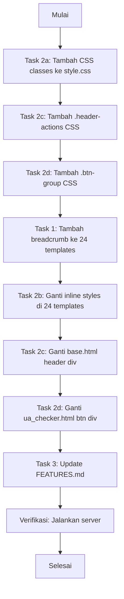

# Rencana Implementasi: Breadcrumb + Inline Style Cleanup + Docs Update

> Audit Siklus 2 — 3 temuan utama yang perlu diperbaiki

---

## 📋 Mapping Tool → Breadcrumb Parameters

Setiap tool page perlu memanggil macro `render_breadcrumb` dengan parameter:
- `category`: Nama kategori (DNS, Domain, SSL, Website, IP)
- `tool_name`: Nama tool yang ditampilkan di breadcrumb
- `tool_url`: URL halaman tool (untuk JSON-LD)
- `category_url`: URL filter kategori di homepage

### DNS Tools (category_url: `/?category=dns`)

| tool_key | template file | tool_name | category_url |
|----------|--------------|-----------|--------------|
| dns_lookup | dns_lookup.html | DNS Lookup | `/?category=dns` |
| reverse_dns | reverse_dns.html | Reverse DNS | `/?category=dns` |
| dns_propagation | dns_propagation.html | DNS Propagation | `/?category=dns` |
| mx_lookup | mx_lookup.html | MX Lookup | `/?category=dns` |
| txt_lookup | txt_lookup.html | TXT Lookup | `/?category=dns` |
| cname_lookup | cname_lookup.html | CNAME Lookup | `/?category=dns` |
| spf_checker | spf_checker.html | SPF Checker | `/?category=dns` |
| dmarc_checker | dmarc_checker.html | DMARC Checker | `/?category=dns` |
| ns_lookup | ns_lookup.html | NS Lookup | `/?category=dns` |

### Domain Tools (category_url: `/?category=domain`)

| tool_key | template file | tool_name | category_url |
|----------|--------------|-----------|--------------|
| whois_lookup | whois_lookup.html | WHOIS Lookup | `/?category=domain` |
| domain_expiry | domain_expiry.html | Domain Expiry | `/?category=domain` |

### SSL Tools (category_url: `/?category=ssl`)

| tool_key | template file | tool_name | category_url |
|----------|--------------|-----------|--------------|
| ssl_checker | ssl_checker.html | SSL Checker | `/?category=ssl` |
| ssl_expiry | ssl_expiry.html | SSL Expiry | `/?category=ssl` |

### Website Tools (category_url: `/?category=website`)

| tool_key | template file | tool_name | category_url |
|----------|--------------|-----------|--------------|
| ping_checker | ping_checker.html | Ping Checker | `/?category=website` |
| http_status | http_status.html | HTTP Status | `/?category=website` |
| redirect_checker | redirect_checker.html | Redirect Checker | `/?category=website` |
| header_checker | header_checker.html | Header Checker | `/?category=website` |
| ua_checker | ua_checker.html | UA Checker | `/?category=website` |

### IP Tools (category_url: `/?category=ip`)

| tool_key | template file | tool_name | category_url |
|----------|--------------|-----------|--------------|
| ip_lookup | ip_lookup.html | IP Lookup | `/?category=ip` |
| asn_lookup | asn_lookup.html | ASN Lookup | `/?category=ip` |
| blacklist_checker | blacklist_checker.html | Blacklist Checker | `/?category=ip` |
| my_ip | my_ip.html | My IP Address | `/?category=ip` |
| email_validator | email_validator.html | Email Validator | `/?category=ip` |
| port_scanner | port_scanner.html | Port Scanner | `/?category=ip` |

---

## Task 1: Tambah Breadcrumb ke 24 Tool Pages

### Perubahan per Template

**Sebelum (semua 24 template):**
```html


...

<a href="/" class="back-link">← Kembali ke Beranda</a>
<h1 class="section-title">...</h1>
```

**Sesudah:**
```html



...

{{ render_breadcrumb("DNS", "DNS Lookup", "/dns-lookup", "/?category=dns") }}
<h1 class="section-title">...</h1>
```

**Key:** `back-link` dihapus, digantikan oleh `render_breadcrumb` macro.

### File yang Perlu Diubah (24 files)

| # | File | Posisi Edit |
|---|------|-------------|
| 1 | `app/templates/tools/dns_lookup.html` | Line 1-5 |
| 2 | `app/templates/tools/reverse_dns.html` | Line 1-5 |
| 3 | `app/templates/tools/dns_propagation.html` | Line 1-5 |
| 4 | `app/templates/tools/mx_lookup.html` | Line 1-5 |
| 5 | `app/templates/tools/txt_lookup.html` | Line 1-5 |
| 6 | `app/templates/tools/cname_lookup.html` | Line 1-5 |
| 7 | `app/templates/tools/spf_checker.html` | Line 1-5 |
| 8 | `app/templates/tools/dmarc_checker.html` | Line 1-5 |
| 9 | `app/templates/tools/ns_lookup.html` | Line 1-5 |
| 10 | `app/templates/tools/whois_lookup.html` | Line 1-5 |
| 11 | `app/templates/tools/domain_expiry.html` | Line 1-5 |
| 12 | `app/templates/tools/ssl_checker.html` | Line 1-5 |
| 13 | `app/templates/tools/ssl_expiry.html` | Line 1-5 |
| 14 | `app/templates/tools/ping_checker.html` | Line 1-5 |
| 15 | `app/templates/tools/http_status.html` | Line 1-5 |
| 16 | `app/templates/tools/redirect_checker.html` | Line 1-5 |
| 17 | `app/templates/tools/header_checker.html` | Line 1-5 |
| 18 | `app/templates/tools/ua_checker.html` | Line 1-5 |
| 19 | `app/templates/tools/ip_lookup.html` | Line 1-5 |
| 20 | `app/templates/tools/asn_lookup.html` | Line 1-5 |
| 21 | `app/templates/tools/blacklist_checker.html` | Line 1-5 |
| 22 | `app/templates/tools/my_ip.html` | Line 1-5 |
| 23 | `app/templates/tools/email_validator.html` | Line 1-5 |
| 24 | `app/templates/tools/port_scanner.html` | Line 1-5 |

---

## Task 2: Ganti Inline Styles dengan CSS Classes

### 2a. Buat `.tool-desc` CSS Class

**File: `app/static/css/style.css`** — tambah setelah `.back-link` styles (~line 1015)

```css
/* ============ TOOL DESCRIPTION ============ */
.tool-desc {
    color: var(--text-secondary);
    margin-bottom: 20px;
    line-height: 1.5;
}
```

### 2b. Ganti di 24 Template

**Sebelum:**
```html
<p style="color:var(--text-secondary);margin-bottom:20px">Deskripsi tool...</p>
```

**Sesudah:**
```html
<p class="tool-desc">Deskripsi tool...</p>
```

### 2c. Buat `.header-actions` CSS Class

**File: `app/static/css/style.css`** — tambah untuk header dark mode toggle area

```css
/* ============ HEADER ACTIONS ============ */
.header-actions {
    display: flex;
    align-items: center;
    gap: 4px;
}
```

**File: `app/templates/base.html`** line 140:
```html
<!-- Sebelum -->
<div style="display:flex;align-items:center;gap:4px">
<!-- Sesudah -->
<div class="header-actions">
```

### 2d. Buat `.btn-group` CSS Class

```css
/* ============ BUTTON GROUP ============ */
.btn-group {
    display: flex;
    gap: 10px;
    flex-wrap: wrap;
}
```

**File: `app/templates/tools/ua_checker.html`** line 18:
```html
<!-- Sebelum -->
<div style="display:flex;gap:10px;flex-wrap:wrap">
<!-- Sesudah -->
<div class="btn-group">
```

---

## Task 3: Update FEATURES.md

### Perubahan

**File: `FEATURES.md`** line 10:
```
# Sebelum
- **19 Tool Pages** - Halaman frontend dengan form interaktif dan hasil real-time

# Sesudah
- **24 Tool Pages** - Halaman frontend dengan form interaktif dan hasil real-time
```

---

## 🔄 Alur Implementasi



**Catatan urutan:**
- Task 2a-2d (CSS) dilakukan DULU agar class sudah tersedia saat template diubah
- Task 1 (breadcrumb) dan Task 2b (inline style) dilakukan BERSAMAAN per template
- Task 3 (docs) dilakukan TERAKHIR

---

## ⚠️ Risiko & Mitigasi

| Risiko | Mitigasi |
|--------|----------|
| Breadcrumb menambah height halaman | CSS sudah ada, compact layout (padding: 12px 0) |
| Inline style di JS-generated HTML | Hanya diubah yang di static HTML, JS-generated biarkan |
| Template error karena syntax | Setiap template diubah satu per satu, verifikasi |
| CSS class konflik | Semua class baru menggunakan naming unik (.tool-desc, .btn-group, .header-actions) |

---

## 📊 Ringkasan Perubahan

| Tipe File | File Count | Perubahan |
|-----------|-----------|-----------|
| CSS | 1 | Tambah 3 classes (.tool-desc, .header-actions, .btn-group) |
| Templates | 24 | +breadcrumb import, +render_breadcrumb macro, -back-link, ganti inline style |
| Base template | 1 | Ganti inline style di header div |
| Documentation | 1 | Update "19" → "24" |
| **Total** | **27 files** | |
