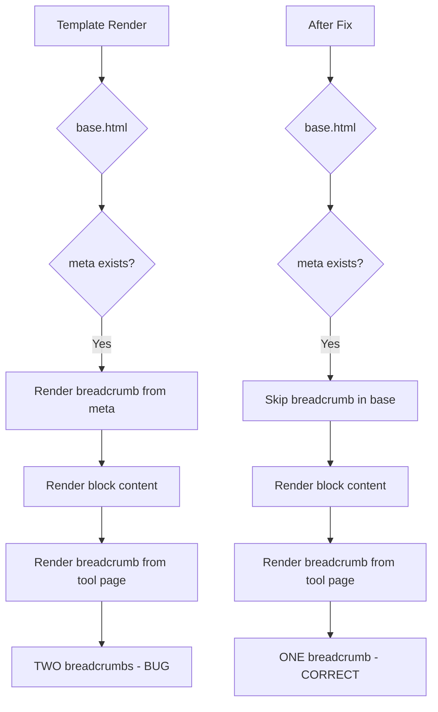

# Audit Siklus 3 — Rencana Perbaikan

> Tanggal: 2026-08-02
> Fokus: Bug kritis, sisa inline styles, konsistensi dokumentasi

---

## Temuan Audit

### 🔴 CRITICAL: Breadcrumb Duplikat di Semua Tool Pages

**Masalah:** `base.html` (line 150-153) SUDAH render breadcrumb otomatis menggunakan `meta.title`:
```html


{{ render_breadcrumb(meta.category, meta.title, request.url.path, category_url) }}

```

Dan SEMUA 24 tool templates JUGA render breadcrumb sendiri:
```html
{{ render_breadcrumb("DNS", "DNS Lookup", "/dns-lookup", "/?category=dns") }}
```

**Akibat:** DUA breadcrumb muncul di setiap tool page:
1. Dari base.html: "DNS Lookup - Cek DNS Records Gratis" (terlalu panjang, pakai full SEO title)
2. Dari tool page: "DNS Lookup" (pendek, benar)

**Bukti curl:**
```
<!-- Breadcrumb 1 (dari base.html - SALAH) -->
<span class="breadcrumb-item breadcrumb-current">DNS Lookup - Cek DNS Records Gratis</span>

<!-- Breadcrumb 2 (dari tool page - BENAR) -->
<span class="breadcrumb-item breadcrumb-current">DNS Lookup</span>
```

**Solusi:** Hapus breadcrumb dari base.html. Tool pages sudah benar dengan nama pendek.

---

### 🟡 MEDIUM: Sisa Inline Styles (15 instances)

| File | Line | Inline Style | Fix |
|------|------|-------------|-----|
| `index.html` | 14 | `style="display:none"` | Tambah CSS class `.hidden-initial` |
| `index.html` | 174 | `style="display:none"` | Tambah CSS class `.hidden-initial` |
| `index.html` | 215 | `style="font-size:0.85em;opacity:0.7"` | Tambah CSS class `.recently-query` |
| `api_docs.html` | 47,68,149,184,220,285 | `style="margin-top:10px"` | Tambah CSS class `.api-example-label` (sudah ada, tinggal pakai) |
| `api_docs.html` | 340 | `style="margin-top:10px;color:#666..."` | Tambah CSS class `.api-note` |
| `about.html` | 18 | `style="margin-top:20px"` | Tambah CSS class `.about-mission-title` |
| `dns_propagation.html` | 70,76,81,84 | JS template inline styles | Tambah CSS classes |
| `ua_checker.html` | 109 | `style="word-break:break-all..."` | Tambah CSS class `.ua-raw` |

---

### 🟡 LOW: Documentation Inconsistency

| File | Issue | Fix |
|------|-------|-----|
| `education.py` line 2 | Docstring: "19 tool pages" | Update ke "24 tool pages" |

---

## Rencana Implementasi

### Task 1: Fix Breadcrumb Duplikat
- Hapus 4 baris breadcrumb dari [`base.html`](app/templates/base.html:150-153) ( `` block )
- Pastikan about.html dan api_docs.html tidak terdampak (mereka tidak punya `meta`)

### Task 2: Tambah CSS Classes untuk Sisa Inline Styles
- Tambah ke [`style.css`](app/static/css/style.css):
  - `.hidden-initial` — `display:none` untuk elemen yang di-toggle via JS
  - `.recently-query` — style untuk query di "Recently Used" cards
  - `.api-note` — style untuk catatan di API docs
  - `.about-mission-title` — margin-top untuk misi di about page
  - `.propagation-meta` — style untuk meta info di propagation results
  - `.propagation-status` — style untuk status cell di propagation table
  - `.propagation-unique` — style untuk unique records section
  - `.ua-raw` — style untuk raw UA string display

### Task 3: Ganti Inline Styles di Templates
- [`index.html`](app/templates/index.html) — 3 inline styles
- [`api_docs.html`](app/templates/api_docs.html) — 7 inline styles
- [`about.html`](app/templates/about.html) — 1 inline style
- [`dns_propagation.html`](app/templates/tools/dns_propagation.html) — 4 inline styles di JS
- [`ua_checker.html`](app/templates/tools/ua_checker.html) — 1 inline style di JS

### Task 4: Update Documentation
- [`education.py`](app/data/education.py:2) — Fix docstring "19" → "24"

### Task 5: Verifikasi
- Restart server
- Test beberapa halaman untuk pastikan tidak ada breadcrumb duplikat
- Test dark mode untuk CSS baru

---

## Diagram Alur Perbaikan



---

## File yang akan diubah

| # | File | Perubahan |
|---|------|-----------|
| 1 | `app/templates/base.html` | Hapus breadcrumb block (4 baris) |
| 2 | `app/static/css/style.css` | Tambah 8 CSS classes baru |
| 3 | `app/templates/index.html` | Ganti 3 inline styles |
| 4 | `app/templates/api_docs.html` | Ganti 7 inline styles |
| 5 | `app/templates/about.html` | Ganti 1 inline style |
| 6 | `app/templates/tools/dns_propagation.html` | Ganti 4 inline styles di JS |
| 7 | `app/templates/tools/ua_checker.html` | Ganti 1 inline style di JS |
| 8 | `app/data/education.py` | Fix docstring |

**Total: 8 file**
