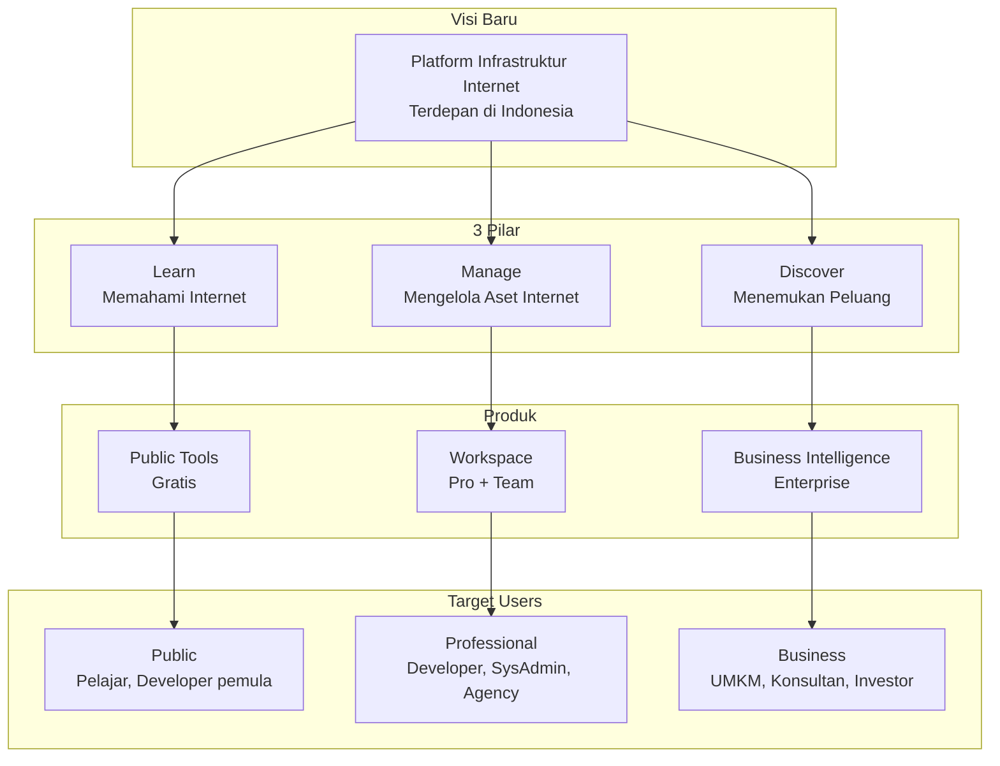

# Rencana Pembaruan Dokumen: Selaras dengan Visi Baru

> **Tujuan:** Memperbarui AGENT.md, FEATURES.md, dan ROADMAP.md agar selaras dengan visi baru Konektivitas.com sebagai **Platform Infrastruktur Internet** dengan 3 Pilar: **Learn, Manage, Discover**.

---

## Ringkasan Perubahan

### Perubahan Utama

| No | Perubahan | Dokumen yang Terpengaruh |
|----|-----------|-------------------------|
| 1 | Visi: "terbesar" → "terdepan" | AGENT.md, ROADMAP.md |
| 2 | Misi: Update ke 5 poin baru | AGENT.md |
| 3 | 3 Produk → 3 Pilar (Learn, Manage, Discover) | AGENT.md, FEATURES.md |
| 4 | Tambah Value Proposition statement | AGENT.md |
| 5 | Tambah Positioning "BUKAN" list | AGENT.md |
| 6 | Business Model: tambah tier "Team" | AGENT.md, FEATURES.md, ROADMAP.md |
| 7 | Nilai yang Dijual: update ke 7 nilai | AGENT.md |
| 8 | Framework Keputusan: tambah 3 pertanyaan | AGENT.md, ROADMAP.md |
| 9 | Tagline: "Memahami. Mengelola. Mengembangkan Internet." (tetap) | Semua |

---

## Detail Perubahan per Dokumen

### 1. AGENT.md

#### 1.1 Overview
**Saat ini:**
> Konektivitas.com adalah platform infrastruktur internet Indonesia yang membantu siapa pun memahami, mengelola, dan mengembangkan aset digital mereka.

**Baru:**
> Internet menjadi fondasi hampir semua layanan digital. Website, aplikasi mobile, AI, IoT, sistem perusahaan, hingga perangkat pintar bergantung pada infrastruktur internet untuk beroperasi.
>
> Namun, mengelola infrastruktur tersebut masih tersebar di banyak layanan dan sering kali rumit.
>
> **Konektivitas hadir untuk menyederhanakan cara orang memahami, mengelola, dan mengembangkan aset internet mereka.**

#### 1.2 Vision
**Saat ini:**
> Menjadi platform infrastruktur internet terbesar di Indonesia yang membantu siapa pun memahami, mengelola, dan mengembangkan aset digital mereka.

**Baru:**
> Menjadi platform infrastruktur internet terdepan di Indonesia yang membantu individu dan bisnis memahami, mengelola, dan mengembangkan aset digital mereka.

#### 1.3 Mission
**Saat ini (5 poin):**
1. Membuat infrastruktur internet mudah dipahami.
2. Membantu pengguna mengelola aset digital dari satu dashboard.
3. Memberikan peringatan sebelum masalah terjadi.
4. Menyediakan insight untuk menemukan peluang digital baru.
5. Menjadi referensi edukasi internet berbahasa Indonesia.

**Baru (5 poin):**
1. Menyederhanakan pengelolaan infrastruktur internet.
2. Menyediakan monitoring yang mudah dipahami.
3. Memberikan edukasi internet dalam bahasa Indonesia.
4. Membantu pengguna mengambil keputusan berdasarkan data.
5. Menjadi pusat kendali aset internet.

#### 1.4 Value Proposition (BARU)
Tambahkan section baru:
> Daripada membuka banyak layanan berbeda, pengguna cukup membuka Konektivitas untuk mendapatkan gambaran menyeluruh tentang aset internet mereka.

#### 1.5 Filosofi (update)
**Saat ini:**
> Website hanyalah permukaan. Di balik website terdapat: Domain, DNS, Server, SSL, Email, IP, Routing, Infrastruktur. Konektivitas membantu mereka memahami semua yang ada di baliknya.

**Baru:**
> Kebanyakan orang hanya melihat website. Konektivitas membantu melihat seluruh infrastruktur yang membuat website tersebut dapat berjalan.

#### 1.6 3 Produk Utama → 3 Pilar Produk (RESTRUCTURE)
**Saat ini:** Public Tools, Workspace, Business Intelligence

**Baru:**

##### Pilar 1: Learn — Membantu orang memahami internet
- Edukasi DNS, SSL, Email, Server, HTTP
- Visualisasi cara kerja internet
- Dokumentasi
- **Target:** Pelajar, Mahasiswa, Guru, Developer pemula
- **Implementasi:** Public Tools (gratis)

##### Pilar 2: Manage — Mengelola aset internet
- Domain, SSL, DNS, Email, Server, API
- Monitoring, Workspace, Team
- Notifikasi, Laporan
- **Target:** Developer, IT Support, SysAdmin, Agency, Startup
- **Implementasi:** Workspace (berbayar)

##### Pilar 3: Discover — Menemukan peluang
- Business Discovery, Industry Insight
- Technology Insight, Digital Opportunity
- Analisis aset digital berbasis data publik
- **Target:** Business Owner, Konsultan, Freelancer, Marketing
- **Implementasi:** Business Intelligence (enterprise)

#### 1.7 Target Pengguna (update slightly)
**Saat ini:**
- 🌐 Public — Orang yang ingin belajar
- 💼 Professional — Orang yang mengelola internet
- 🏢 Business — Orang yang ingin mengembangkan bisnis

**Baru:**
- 🌐 Public — Belajar, Mengecek, Mencari referensi
- 💼 Professional — Monitoring, Workspace, Manajemen aset
- 🏢 Business — Insight, Peluang, Analisis

#### 1.8 Positioning (BARU)
Tambahkan section:
> **Bukan:**
> - Domain Registrar
> - Hosting Provider
> - Cloud Provider
>
> **Tetapi:** Platform Infrastruktur Internet.

#### 1.9 Model Bisnis (update)
**Saat ini:** Gratis / Premium / Enterprise

**Baru:** Free / Pro / Team / Enterprise
- **Free:** Checker dan edukasi
- **Pro:** Workspace
- **Team:** Kolaborasi
- **Enterprise:** Monitoring skala perusahaan, API, dan dashboard khusus

#### 1.10 Nilai yang Dijual (update)
**Saat ini:**
- Kejelasan, Ketenangan, Insight, Edukasi, Peluang

**Baru:**
- Kejelasan, Monitoring, Edukasi, Insight, Efisiensi, Produktivitas, Kepercayaan

#### 1.11 Pertanyaan Penuntun (update)
**Saat ini:**
> "Apakah fitur ini membantu pengguna memahami, mengelola, atau mengembangkan aset internetnya?"

**Baru (3 pertanyaan berdasarkan pilar):**
1. "Apakah fitur ini membantu pengguna memahami internet?" *(Learn)*
2. "Apakah fitur ini membantu pengguna mengelola aset internetnya?" *(Manage)*
3. "Apakah fitur ini membantu pengguna menemukan peluang atau mengambil keputusan?" *(Discover)*

Jika jawabannya "ya" untuk setidaknya satu, fitur itu sejalan dengan visi Konektivitas.

#### 1.12 Filosofi Pengembangan (add framework)
Tambahkan di section "Saat Mengerjakan Fitur":
- Gunakan **3 Pertanyaan Pilar** untuk menentukan apakah fitur sejalan dengan produk
- Gunakan **3 Syarat Teknis** (Ringan, Berguna, Tahan Lama) untuk menentukan apakah fitur layak diimplementasikan

#### 1.13 Sisa dokumen
- Struktur Proyek: TIDAK BERUBA
- Arsitektur Teknis: TIDAK BERUBA
- Status Implementasi: TIDAK BERUBA
- Konvensi Penamaan: TIDAK BERUBA
- Checklist (Performance, SEO, Feature): TIDAK BERUBA
- Target Metrics: TIDAK BERUBA (sudah sesuai)
- Monetisasi: Update tier pricing (tambah Team)
- Referensi: TIDAK BERUBA

---

### 2. FEATURES.md

#### 2.1 Struktur Header
**Saat ini:**
> Daftar lengkap fitur per fase implementasi, terstruktur berdasarkan 3 produk utama.

**Baru:**
> Daftar lengkap fitur per fase implementasi, terstruktur berdasarkan 3 pilar produk: Learn, Manage, Discover.

#### 2.2 Produk 1: Public Tools → Pilar Learn
**Saat ini:** "Produk 1: Public Tools (Gratis)"

**Baru:** "Pilar 1: Learn — Memahami Internet"
- Subtitle: Public Tools (gratis) sebagai implementasi pilar Learn

#### 2.3 Produk 2: Workspace → Pilar Manage
**Saat ini:** "Produk 2: Workspace (Berbayar)"

**Baru:** "Pilar 2: Manage — Mengelola Aset Internet"
- Subtitle: Workspace (berbayar) sebagai implementasi pilar Manage

#### 2.4 Produk 3: Business Intelligence → Pilar Discover
**Saat ini:** "Produk 3: Business Intelligence (Enterprise)"

**Baru:** "Pilar 3: Discover — Menemukan Peluang"
- Subtitle: Business Intelligence (enterprise) sebagai implementasi pilar Discover

#### 2.5 Business Model
Tambahkan tier "Team" di section monetisasi/referensi jika ada.

#### 2.6 Sisa dokumen
- Detail fitur per fase: TIDAK BERUBA (sudah lengkap)
- Technology Stack: TIDAK BERUBA
- Security Features: TIDAK BERUBA
- SEO/Performance/Feature Checklists: TIDAK BERUBA

---

### 3. ROADMAP.md

#### 3.1 Header Quote
**Saat ini:**
> "Bagaimana Konektivitas menjadi tempat pertama yang dibuka seseorang ketika ingin memahami, mengelola, atau mengembangkan aset digitalnya?"

**Tetap** (sudah sejalan dengan visi baru)

#### 3.2 Vision (di section Referensi atau overview)
Pastikan menggunakan "terdepan" bukan "terbesar".

#### 3.3 Pendapatan per Tahun
Tambahkan tier "Team" di tabel pendapatan yang relevan.

#### 3.4 Filosofi Pengembangan
**Saat ini:**
> "Kami tidak menjual server. Kami menyediakan layanan internet yang akan tetap dibutuhkan selama internet ada."

**Baru:**
> "Kami tidak membuat aplikasi yang viral. Kami membangun utilitas yang akan tetap dibutuhkan selama internet masih ada."

#### 3.5 Aturan Fitur
Tambahkan 3 pertanyaan pilar di samping 3 syarat teknis.

#### 3.6 Sisa dokumen
- Target per tahun: TIDAK BERUBA
- Evolusi Teknologi: TIDAK BERUBA
- Target Akhir Tahun ke-5: TIDAK BERUBA

---

## Urutan Implementasi

1. **AGENT.md** — Update terlebih dahulu karena ini adalah "source of truth"
2. **FEATURES.md** — Update struktur berdasarkan 3 pilar
3. **ROADMAP.md** — Update visi, pendapatan, dan filosofi
4. **Review** — Pastikan konsistensi antar ketiga dokumen

---

## Diagram Arsitektur Dokumen

---

## Checklist Konsistensi

Setelah update, pastikan:

- [ ] Tagline "Memahami. Mengelola. Mengembangkan Internet." konsisten di semua dokumen
- [ ] Visi "terdepan" konsisten di semua dokumen
- [ ] 3 Pilar (Learn, Manage, Discover) digunakan sebagai framework utama
- [ ] 3 Pertanyaan Pilar ada di AGENT.md dan ROADMAP.md
- [ ] 3 Syarat Teknis (Ringan, Berguna, Tahan Lama) tetap ada
- [ ] Tier bisnis (Free, Pro, Team, Enterprise) konsisten
- [ ] Nilai yang Dijual (7 nilai) konsisten
- [ ] Positioning "BUKAN" ada di AGENT.md
- [ ] Value Proposition ada di AGENT.md
- [ ] Semua link referensi antar dokumen masih valid
